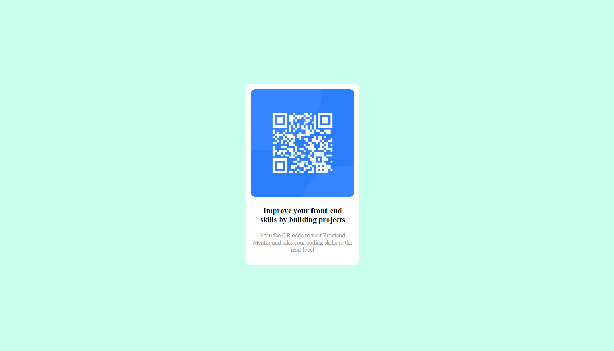

### Screenshot

### Built with

- CSS
- HTML
- CSS Grid

### What I learned
I learn about how to use css media query with tags like @media only screen and (max-width: 716px)
and many more like css font size, colors, width and so on

### Continued development

I want to improve in css design and also media query

## Author

- Website - [Happy ]
- Frontend Mentor - [@happyrw](https://www.frontendmentor.io/profile/happyrw)
- Twitter - [@happy001199](https://www.twitter.com/happy001199)

